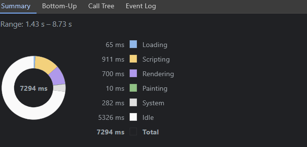
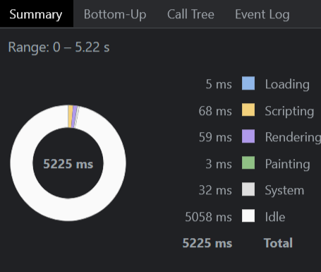

## SQL Sprint

SQL Sprint is an online SQL Editor. 

##  Live Demo

https://sql-sprint.vercel.app/

## Features

### Available Databases:

On the top-right section, you will find a section labeled "Your Database" listing all available databases. You can click on these databases to access and review their data.

### Available Queries:

On the far left side, there is a section called "Available Queries," where you can click on the provided queries to input them into the query box.

### Input Box:

At the top center, you'll see an input box with two buttons.
In the input box, you can write your SQL query. Afterward, click the "Run" button above to execute the query.
There's also a "Clear" button that clears the input box when clicked.

### Output Box:

In the bottom center, there's an output box where the results of your executed query are displayed.

### History:

The "History" section displays the latest 8 queries you've run.

### Export:

Clicking the "Export" button opens a dropdown menu with three options:
1. CSV - Clicking this option will download your output as a CSV file.
2. JSON - Choosing this option will download your output as a JSON file.
3. XML - Selecting this option will download your output as an XML file.

### Reset:

If you want to reset everything to the initial state, you can use the "Reset" button.

### Mail Support:

By clicking the "Mail" button, you can share your feedback or report any issues you encounter via email.

## Getting Started

1. First, Install node modules:

```bash
npm install
```

2. Run the development server:

```bash
npm run dev
```

## Tech-Stack

- Next.js
- TailWindCSS
- Packages Installed
 -- papaparse , react-toastify

## Page Load Time

Steps taken to measure the Page Load Time
1. Open the Chrome Devtools.
2. Select the "Performance" tab.
3. Press Ctrl+Shift+E(Windows)

### Page Load Time Before:-



### Page Load Time After:-



### Performance:-


##  Optimization done to decrease page load time

1. Refactoring of code to separate concerns more clearly, making it easier to maintain and optimize.
2. Ensured to only import the necessary components and libraries in code. Unused imports can bloat the bundle size.
3. Used React Fragment (<>...</>) to avoid unnecessary parent elements.


